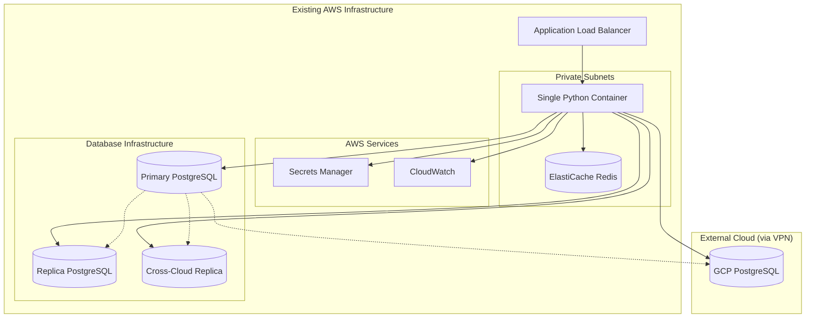

# Design Document

## Overview

The PostgreSQL Replication Manager is a containerized web application that provides centralized management of PostgreSQL logical replication across multi-cloud environments, while also monitoring existing physical replication streams. The system will be deployed within AWS VPC infrastructure and serve as the single point of access for database operations, eliminating the need for individual bastion host connections and manual script execution.

The application consists of a single Python FastAPI server that serves both a web interface and provides the backend API. It integrates with AWS services including Secrets Manager for credential management and uses ElastiCache Redis for lightweight state storage. The system will discover existing replication topologies on startup and maintain minimal state for monitoring and configuration.

## Architecture

### Technology Stack

The system is built using modern Python technologies optimized for async operations and high performance:

- **Runtime**: Python 3.13+ with asyncio for concurrent operations
- **Web Framework**: FastAPI 0.117+ for high-performance async API and web interface
- **Data Validation**: Pydantic v2 (2.11+) for comprehensive data validation and serialization
- **Database Driver**: asyncpg 0.30+ for high-performance PostgreSQL async connectivity
- **Caching**: Redis 5.0+ via redis-py for state storage and caching
- **AWS Integration**: boto3 1.34+ for AWS service integration
- **Testing**: pytest 8.4+ with pytest-cov for comprehensive test coverage
- **Code Quality**: Ruff 0.13+ for fast linting and formatting
- **Containerization**: Docker with multi-stage builds for production optimization

### Development Environment

The project follows modern Python development practices:

- **Virtual Environment**: Python venv for isolated dependency management
- **Package Management**: pip with pinned versions in requirements.txt and requirements-dev.txt
- **Code Quality**: Ruff configured for 120-character line length and comprehensive linting
- **Testing**: pytest with coverage reporting (minimum 80% coverage requirement)
- **Local Development**: Make commands for setup, testing, linting, and service management
- **Git Integration**: Comprehensive .gitignore for Python, cache files, and development artifacts

### High-Level Architecture



### Deployment Architecture

The system will be deployed as a single ECS service with the following assumptions:
- **Existing Infrastructure**: ALB, VPC, private subnets, and HTTPS termination already configured
- **Single Container**: Python FastAPI application serving both web interface and API endpoints
- **State Storage**: ElastiCache Redis for lightweight configuration and metrics caching
- **Network Access**: Direct connectivity to databases in private subnets (no NAT Gateway required)
- **Discovery Mode**: Application discovers existing replication topology on startup

## Components and Interfaces

### Web Interface Components

#### Topology Visualization Interface
- **Purpose**: Display interactive replication topology map
- **Technology**: HTML/CSS/JavaScript with D3.js or vis.js for graph visualization
- **Implementation**: Served as static files by FastAPI with dynamic data via API
- **Features**:
  - Node representation for each database
  - Edge representation for replication streams
  - Real-time status updates via WebSocket
  - Color coding for connection status and health

#### Replication Status Dashboard
- **Purpose**: Show detailed replication metrics and health
- **Implementation**: HTML templates with Jinja2, dynamic updates via HTMX or JavaScript
- **Features**:
  - Replication lag monitoring with time-series charts
  - Backfill progress indicators
  - Error log display with filtering and search
  - Publication/subscription status tables

#### Migration Execution Interface
- **Purpose**: Provide interface for schema migration management
- **Implementation**: HTML forms with JavaScript for enhanced UX
- **Features**:
  - SQL editor with syntax highlighting (CodeMirror)
  - Migration history and rollback capabilities
  - Execution progress tracking
  - Result reporting with success/failure details

#### Configuration Management Interface
- **Purpose**: Manage database endpoints and credentials
- **Implementation**: FastAPI forms with validation and HTMX for dynamic updates
- **Features**:
  - Form-based database configuration
  - Secrets Manager ARN validation
  - Connection testing utilities
  - Bulk configuration import/export

### Backend API Components

#### Database Connection Manager
- **Purpose**: Handle all PostgreSQL connections and credential management
- **Implementation**: Connection pooling with asyncpg and SQLAlchemy async
- **Features**:
  - AWS Secrets Manager integration using boto3 for credential retrieval
  - Connection health monitoring with asyncio
  - Automatic reconnection handling
  - IAM authentication support via RDS IAM tokens

#### Replication Monitor Service
- **Purpose**: Monitor both logical and physical replication status and collect metrics
- **Implementation**: Background tasks using asyncio and APScheduler with Redis caching
- **Features**:
  - **Logical Replication**: Query subscription status from pg_subscription and publication details
  - **Physical Replication**: Monitor streaming replication from pg_stat_replication view
  - **RDS Integration**: Display RDS cluster replicas, cross-region replicas, and read replicas
  - **Lag Monitoring**: Track both logical (LSN-based) and physical (byte/time-based) replication lag
  - Parse PostgreSQL logs for replication errors using psycopg2 log parsing
  - Cache metrics in Redis with TTL using redis-py
  - Auto-discovery of existing publications, subscriptions, and physical replication streams

#### Migration Executor Service
- **Purpose**: Execute schema migrations across replica endpoints
- **Implementation**: Async transaction-based execution with rollback support using asyncpg
- **Features**:
  - Sequential execution across endpoints with asyncio
  - Transaction isolation for each migration
  - Detailed logging using Python logging with structured output
  - Migration state persistence in Redis

#### Configuration Service
- **Purpose**: Manage application configuration and database metadata
- **Implementation**: FastAPI endpoints with Pydantic models and Redis storage
- **Features**:
  - CRUD operations for database configurations stored in Redis using redis-py
  - Secrets Manager ARN validation using boto3
  - Topology discovery from existing replication streams
  - Configuration import/export using JSON serialization

### External Integrations

#### AWS Secrets Manager Integration
- **Purpose**: Secure credential retrieval and management
- **Implementation**: AWS SDK v3 with IAM role-based authentication
- **Features**:
  - Automatic credential rotation support
  - Caching with TTL for performance
  - Error handling for permission issues
  - Audit logging for credential access

#### PostgreSQL Replication Integration
- **Purpose**: Direct interaction with both logical and physical PostgreSQL replication features
- **Implementation**: asyncpg and psycopg2 for PostgreSQL connectivity with replication protocol support
- **Features**:
  - **Logical Replication Management**: Publication and subscription creation/management using SQL commands
  - **Physical Replication Monitoring**: Read-only monitoring of streaming replication status
  - **Replication Slot Monitoring**: Track both logical and physical replication slots using pg_replication_slots
  - **WAL Position Tracking**: Monitor WAL positions using pg_current_wal_lsn() and related functions
  - **Conflict Resolution**: Monitor logical replication conflicts via pg_stat_subscription_stats
  - **Topology Discovery**: Query pg_publication, pg_subscription, and pg_stat_replication views
  - **RDS Awareness**: Use boto3 RDS client to detect and display RDS-managed physical replicas
  - **Automatic Detection**: Discover existing logical and physical replication relationships on startup

## Data Models

All data models are implemented using Pydantic v2 for comprehensive validation, serialization, and Redis integration. Models include custom validators for UUIDs, PostgreSQL identifiers, and AWS ARNs.

### Database Configuration Model
```python
class DatabaseConfig(BaseModel, RedisModelMixin):
    """Database configuration with comprehensive validation"""
    
    model_config = ConfigDict(str_strip_whitespace=True)
    
    id: str = Field(default_factory=lambda: str(uuid.uuid4()))
    name: str = Field(..., min_length=1, max_length=63)
    host: str = Field(..., min_length=1)
    port: int = Field(default=5432, ge=1, le=65535)
    database: str = Field(..., min_length=1, max_length=63)
    credentials_arn: str = Field(..., pattern=r"^arn:aws:secretsmanager:.*")
    role: Literal["primary", "replica"] = Field(...)
    environment: str = Field(..., min_length=1)
    cloud_provider: Literal["aws", "gcp"] = Field(default="aws")
    vpc_id: str | None = Field(None)
    subnet_ids: list[str] = Field(default_factory=list)
    security_group_ids: list[str] = Field(default_factory=list)
    use_iam_auth: bool = Field(default=False)
    created_at: DatetimeSerializer = Field(default_factory=datetime.utcnow)
    updated_at: DatetimeSerializer = Field(default_factory=datetime.utcnow)
    
    @field_validator("name")
    @classmethod
    def validate_name(cls, v: str) -> str:
        """Validate database name contains only allowed characters"""
        if not v.replace("-", "").replace("_", "").replace(" ", "").isalnum():
            raise ValueError(
                "name must contain only alphanumeric characters, "
                "hyphens, underscores, and spaces"
            )
        return v
```

### Replication Stream Model
```python
class ReplicationStream(BaseModel, RedisModelMixin):
    """Replication stream with validation for PostgreSQL identifiers"""
    
    model_config = ConfigDict(str_strip_whitespace=True)
    
    id: str = Field(default_factory=lambda: str(uuid.uuid4()))
    source_db_id: str = Field(..., description="Source database UUID")
    target_db_id: str = Field(..., description="Target database UUID")
    type: Literal["logical", "physical"] = Field(...)
    
    # Logical replication specific
    publication_name: str | None = Field(None, max_length=63)
    subscription_name: str | None = Field(None, max_length=63)
    
    # Physical replication specific
    replication_slot_name: str | None = Field(None, max_length=63)
    wal_sender_pid: int | None = Field(None, ge=1)
    
    # Common fields
    status: Literal["active", "inactive", "error", "syncing"] = Field(default="inactive")
    lag_bytes: int = Field(default=0, ge=0)
    lag_seconds: float = Field(default=0.0, ge=0.0)
    last_sync_time: OptionalDatetimeSerializer = Field(None)
    error_message: str | None = Field(None)
    is_managed: bool = Field(True, description="Whether this stream can be modified (logical=true, physical=false)")
    created_at: DatetimeSerializer = Field(default_factory=datetime.utcnow)
    
    @field_validator("source_db_id", "target_db_id")
    @classmethod
    def validate_database_id(cls, v: str) -> str:
        """Validate database ID is UUID"""
        try:
            uuid.UUID(v)
        except ValueError:
            raise ValueError("Database ID must be a valid UUID") from None
        return v
    
    @field_validator("publication_name", "subscription_name", "replication_slot_name")
    @classmethod
    def validate_postgres_name(cls, v: str | None) -> str | None:
        """Validate PostgreSQL identifier naming rules"""
        if v is not None:
            if not v.replace("_", "").isalnum():
                raise ValueError(
                    "PostgreSQL names must contain only alphanumeric characters "
                    "and underscores"
                )
            if len(v) > 63:  # PostgreSQL identifier limit
                raise ValueError("PostgreSQL names must be 63 characters or less")
        return v
```

### Migration Execution Model
```python
class MigrationResult(BaseModel):
    """Result of migration execution on a single database"""
    
    model_config = ConfigDict(str_strip_whitespace=True)
    
    database_id: str
    status: Literal["success", "failed"] = Field(..., description="Migration result status")
    execution_time: float = Field(..., ge=0.0, description="Execution time in seconds")
    error_message: str | None = Field(None, description="Error message if failed")
    rows_affected: int | None = Field(None, ge=0, description="Number of rows affected")
    
    @field_validator("database_id")
    @classmethod
    def validate_database_id(cls, v: str) -> str:
        """Validate database ID is UUID"""
        try:
            uuid.UUID(v)
        except ValueError:
            raise ValueError("Database ID must be a valid UUID") from None
        return v


class MigrationExecution(BaseModel, RedisModelMixin):
    """Migration execution model with comprehensive validation"""
    
    model_config = ConfigDict(str_strip_whitespace=True)
    
    id: str = Field(default_factory=lambda: str(uuid.uuid4()))
    migration_script: str = Field(..., min_length=1, description="SQL migration script")
    target_databases: list[str] = Field(..., min_length=1, description="List of target database IDs")
    status: Literal["pending", "running", "completed", "failed"] = Field(default="pending")
    results: list[MigrationResult] = Field(default_factory=list)
    started_at: OptionalDatetimeSerializer = Field(None, description="Migration start time")
    completed_at: OptionalDatetimeSerializer = Field(None, description="Migration completion time")
    created_by: str = Field(..., description="User who created the migration")
    created_at: DatetimeSerializer = Field(default_factory=datetime.utcnow)
    
    @field_validator("target_databases")
    @classmethod
    def validate_target_databases(cls, v: list[str]) -> list[str]:
        """Validate all target database IDs are UUIDs"""
        for db_id in v:
            try:
                uuid.UUID(db_id)
            except ValueError:
                raise ValueError(f"Database ID {db_id} must be a valid UUID") from None
        return v
    
    @model_validator(mode="after")
    def validate_completed_at(self) -> "MigrationExecution":
        """Ensure completed_at is after started_at"""
        if (
            self.completed_at is not None
            and self.started_at is not None
            and self.completed_at < self.started_at
        ):
            raise ValueError("completed_at must be after started_at")
        return self
```

### Replication Metrics Model
```python
class ReplicationMetrics(BaseModel):
    """Replication metrics with validation for PostgreSQL WAL positions"""
    
    model_config = ConfigDict(str_strip_whitespace=True)
    
    stream_id: str = Field(..., description="Replication stream UUID")
    timestamp: DatetimeSerializer = Field(default_factory=datetime.utcnow)
    lag_bytes: int = Field(..., ge=0, description="Replication lag in bytes")
    lag_seconds: float = Field(..., ge=0.0, description="Replication lag in seconds")
    wal_position: str = Field(..., description="PostgreSQL WAL position (LSN)")
    synced_tables: int = Field(..., ge=0, description="Number of synchronized tables")
    total_tables: int = Field(..., ge=0, description="Total number of tables")
    backfill_progress: float | None = Field(None, ge=0.0, le=100.0, description="Backfill progress percentage")
    
    @field_validator("stream_id")
    @classmethod
    def validate_stream_id(cls, v: str) -> str:
        """Validate stream ID is UUID"""
        try:
            uuid.UUID(v)
        except ValueError:
            raise ValueError("Stream ID must be a valid UUID") from None
        return v
    
    @field_validator("wal_position")
    @classmethod
    def validate_wal_position(cls, v: str) -> str:
        """Validate PostgreSQL WAL position format (LSN)"""
        # PostgreSQL LSN format: XXXXXXXX/XXXXXXXX (hex/hex)
        import re
        if not re.match(r"^[0-9A-F]+/[0-9A-F]+$", v.upper()):
            raise ValueError("WAL position must be in PostgreSQL LSN format (XXXXXXXX/XXXXXXXX)")
        return v.upper()

### Redis Serialization Utilities

All models inherit from `RedisModelMixin` which provides:
- Automatic JSON serialization/deserialization for Redis storage
- Redis key generation based on model type and ID
- Batch operations for efficient Redis operations
- TTL support for cached data
```

## Error Handling

### Database Connection Errors
- **Timeout Handling**: Configurable connection timeouts with exponential backoff
- **Credential Errors**: Specific error messages for IAM and Secrets Manager issues
- **Network Errors**: Retry logic with circuit breaker pattern
- **SSL/TLS Errors**: Clear messaging for certificate and encryption issues

### Replication Errors
- **Conflict Resolution**: Detection and reporting of replication conflicts
- **Schema Mismatch**: Validation of schema compatibility before replication setup
- **Slot Management**: Automatic cleanup of unused replication slots
- **Publication Errors**: Validation of table permissions and publication configuration

### Migration Errors
- **Syntax Validation**: Pre-execution SQL syntax checking
- **Transaction Rollback**: Automatic rollback on migration failures
- **Dependency Checking**: Validation of migration dependencies and order
- **Concurrent Execution**: Prevention of concurrent migrations on same database

### Application Errors
- **Configuration Validation**: Comprehensive validation of all configuration inputs
- **Resource Limits**: Monitoring and alerting for resource exhaustion
- **Service Degradation**: Graceful degradation when external services are unavailable
- **Audit Logging**: Comprehensive logging of all operations for troubleshooting

## Testing Strategy

### Unit Testing
- **Backend Services**: Jest-based unit tests for all service classes
- **Database Operations**: Mock database connections for isolated testing
- **AWS Integration**: Mocked AWS SDK calls for credential and secrets testing
- **Validation Logic**: Comprehensive testing of all validation functions

### Integration Testing
- **Database Connectivity**: Test actual PostgreSQL connections in test environment
- **Replication Setup**: End-to-end testing of replication stream creation
- **Migration Execution**: Testing of schema migration across multiple databases
- **AWS Services**: Integration testing with actual AWS services in test account

### End-to-End Testing
- **Web Interface**: Cypress-based testing of complete user workflows
- **API Testing**: Postman/Newman collection for API endpoint testing
- **Replication Scenarios**: Testing of various replication topologies and failure modes
- **Performance Testing**: Load testing of concurrent operations and large datasets

### Security Testing
- **Credential Handling**: Verification that credentials are never logged or exposed
- **IAM Permissions**: Testing of least-privilege access patterns
- **Input Validation**: SQL injection and XSS prevention testing
- **Network Security**: Verification of VPC and security group configurations

### Development Workflow and Tooling

#### Make Commands for Development
The project includes comprehensive Make commands for streamlined development:

```makefile
# Development setup and management
make setup          # Create venv and install dependencies
make dev-services   # Start Docker services (LocalStack, Redis, PostgreSQL)
make run           # Run FastAPI application with hot reload

# Code quality and testing
make test          # Run pytest with coverage reporting (minimum 80%)
make lint          # Run Ruff linting and formatting checks
make lint-fix      # Auto-fix linting issues with Ruff

# Production builds
make build         # Build optimized Docker container
make clean         # Clean up Docker resources
```

#### Code Quality Standards
- **Linting**: Ruff configured for comprehensive Python linting with 120-character line length
- **Formatting**: Ruff formatter for consistent code style
- **Type Checking**: Python 3.13+ type hints throughout codebase
- **Testing**: pytest with minimum 80% coverage requirement
- **Documentation**: Comprehensive docstrings and inline comments

#### Git Integration
Comprehensive .gitignore covering:
- Python cache files (`__pycache__/`, `.pytest_cache/`)
- Virtual environments (`venv/`)
- Coverage reports (`.coverage`, `htmlcov/`)
- Linting cache (`.ruff_cache/`)
- IDE and OS specific files

#### Production vs Development Environments
- **Development**: Virtual environment with hot reload and debugging tools
- **Production**: Multi-stage Docker builds with optimized Python images
- **Testing**: LocalStack for AWS service emulation during development
- **Dependencies**: Separate requirements.txt (production) and requirements-dev.txt (development)

### Local Development and Testing with LocalStack

#### LocalStack Setup
- **Services**: LocalStack will emulate AWS Secrets Manager, ElastiCache, and RDS for local development
- **Configuration**: Docker Compose setup with LocalStack providing all AWS services
- **Test Data**: Seed scripts to populate test secrets, ElastiCache configuration, and RDS instances
- **Environment**: Environment variables to switch between LocalStack and real AWS services

#### Local Test Environment
```yaml
# docker-compose.test.yml structure
services:
  localstack:
    image: localstack/localstack
    environment:
      - SERVICES=secretsmanager,elasticache,rds
      - DEBUG=1
    ports:
      - "4566:4566"
    volumes:
      - "./localstack-init:/etc/localstack/init/ready.d"
  
  # LocalStack will provide Redis via ElastiCache emulation
  # LocalStack will provide PostgreSQL via RDS emulation
  
  app:
    build: .
    environment:
      - AWS_ENDPOINT_URL=http://localstack:4566
      - ELASTICACHE_ENDPOINT=localstack:4566
      - RDS_ENDPOINT=localstack:4566
    depends_on:
      - localstack
```

#### LocalStack Initialization Scripts
```bash
# localstack-init/setup.sh
# Create ElastiCache Redis cluster
awslocal elasticache create-cache-cluster \
  --cache-cluster-id test-redis \
  --engine redis \
  --cache-node-type cache.t3.micro

# Create RDS PostgreSQL instances for testing
awslocal rds create-db-instance \
  --db-instance-identifier test-primary \
  --db-instance-class db.t3.micro \
  --engine postgres \
  --master-username testuser \
  --master-user-password testpass

awslocal rds create-db-instance \
  --db-instance-identifier test-replica \
  --db-instance-class db.t3.micro \
  --engine postgres \
  --master-username testuser \
  --master-user-password testpass

# Create test secrets in Secrets Manager
awslocal secretsmanager create-secret \
  --name "test/postgres/primary" \
  --secret-string '{"username":"testuser","password":"testpass"}'
```

#### Test Scenarios
- **AWS Service Integration**: Test ElastiCache Redis and RDS PostgreSQL connectivity via LocalStack
- **Topology Discovery**: Test discovery of pre-configured replication between LocalStack RDS instances
- **Secrets Integration**: Test credential retrieval from LocalStack Secrets Manager
- **Replication Monitoring**: Test lag calculation and status monitoring with LocalStack RDS
- **Migration Execution**: Test schema migration across multiple LocalStack PostgreSQL instances
- **ElastiCache Operations**: Test Redis caching and configuration storage via LocalStack ElastiCache
- **Error Handling**: Test various failure scenarios with controlled LocalStack environment

#### CI/CD Integration
- **GitHub Actions**: Automated testing pipeline using LocalStack and test containers
- **Test Coverage**: Unit tests, integration tests, and end-to-end tests in LocalStack environment
- **Performance Testing**: Load testing against LocalStack services to validate scalability
- **Security Scanning**: Automated security testing of container images and dependencies

### Monitoring and Observability
- **Application Metrics**: Custom CloudWatch metrics for replication lag and errors
- **Health Checks**: Comprehensive health endpoints for load balancer integration
- **Distributed Tracing**: Request tracing across all service components
- **Log Aggregation**: Structured logging with correlation IDs for troubleshooting