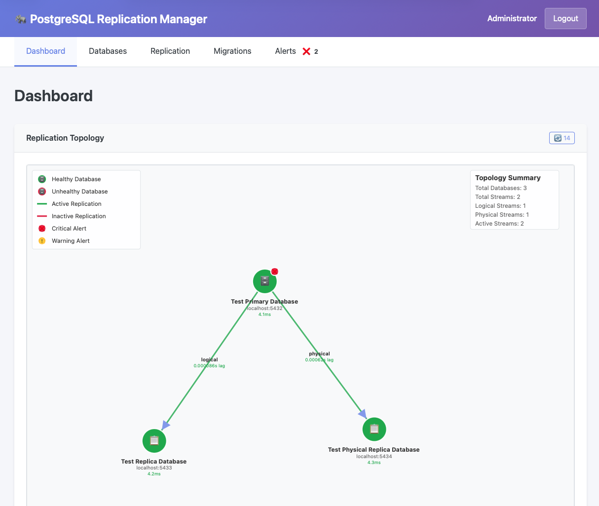

# PostgreSQL Replication Manager

[](https://github.com/ckdake/pgrepbot/actions)
[](https://codecov.io/gh/ckdake/pgrepbot)
[](https://www.python.org/downloads/)
[](https://opensource.org/licenses/MIT)

A web-based tool for centralized management of PostgreSQL logical replication across multi-cloud environments (AWS, GCP) with support for monitoring physical replication streams.

## Features

- 🔄 **Logical Replication Management**: Create and manage PostgreSQL logical replication streams
- 👁️ **Physical Replication Monitoring**: Monitor existing RDS clusters, cross-region replicas, and read replicas
- 🌐 **Multi-Cloud Support**: Manage replication across AWS and GCP environments
- 🔐 **AWS Integration**: Seamless integration with Secrets Manager, ElastiCache, and RDS
- 🚀 **Schema Migrations**: Execute schema migrations across all replica endpoints
- 📊 **Visual Topology**: Interactive visualization of replication topology
- 🔔 **Alerting**: Configurable alerts for replication lag and failures

## Dashboard



The dashboard provides a comprehensive view of your PostgreSQL replication topology with:
- **Visual topology diagram** showing database connections and replication streams
- **Health status indicators** with response times for each database
- **Alert badges** on databases with active issues
- **Interactive layout** - drag nodes to arrange the topology as needed
- **Real-time monitoring** with automatic refresh and countdown timer

## Quick Start

### Prerequisites

- Python 3.13+ installed
- Docker and Docker Compose installed
- Make (recommended)

### Local Development Setup

```bash
# 1. Set up development environment (first time only)
make setup

# 2. Activate virtual environment
source venv/bin/activate

# 3. Start supporting services
make dev-services

# 4. Run the application (in another terminal with venv activated)
make run
```

This will:
1. Create a Python virtual environment with all dependencies
2. Start LocalStack for AWS service emulation
3. Start Redis and PostgreSQL containers for testing
4. Run the FastAPI application locally with hot reload

## Access Points

- **Main Application**: http://localhost:8000
- **API Documentation**: http://localhost:8000/docs
- **LocalStack Dashboard**: http://localhost:4566
- **Health Check**: http://localhost:8000/health

## Development Commands

```bash
make setup        # Set up local development environment (first time only)
make dev-services # Start services (LocalStack, Redis, PostgreSQL)
make run          # Run application locally (requires venv activation)
make test         # Run tests locally (requires venv activation)
make lint         # Run linter locally (requires venv activation)
make lint-fix     # Fix linting issues automatically
make build        # Build production Docker image
make clean        # Clean up Docker resources
```

**Note**: All development commands except `make setup` and `make dev-services` require an activated virtual environment (`source venv/bin/activate`).

## Architecture

The application consists of:

- **FastAPI Backend**: Python web server with async PostgreSQL connectivity
- **LocalStack**: AWS service emulation for development (Secrets Manager, IAM)
- **Redis**: Direct Redis container for configuration and metrics caching
- **PostgreSQL**: Primary and replica containers for testing logical replication
- **Authentication**: IAM Identity Center, Secrets Manager, or auth key fallback

## Authentication Methods

The system supports three authentication methods with automatic fallback:

1. **AWS IAM Identity Center** (Primary): SAML/OIDC integration
2. **Secrets Manager** (Fallback): Username/password from AWS Secrets Manager
3. **Auth Key** (Development): Simple shared key via `AUTH_KEY` environment variable

## Development Status

- ✅ **Task 1**: Project structure and development environment
- ✅ **Task 2**: Core data models and validation  
- ✅ **Task 3**: Authentication and authorization system
- ✅ **Task 4**: AWS service integration layer
- ✅ **Task 5**: PostgreSQL connection management
- ✅ **Task 6**: Replication discovery and monitoring core
- ⏳ **Task 7**: Replication stream management
- ⏳ **Task 8**: Schema migration execution
- ⏳ **Task 9**: Web application foundation
- ⏳ **Task 10**: Topology visualization
- ⏳ **Task 11**: Alerting and error handling
- ⏳ **Task 12**: Deployment configuration
- ⏳ **Task 13**: Comprehensive testing

### Current Features (Tasks 1-6 Complete)

🎉 **Working Features:**
- **Multi-method Authentication**: IAM Identity Center, Secrets Manager, and Auth Key support
- **AWS Integration**: LocalStack development environment with Secrets Manager, ElastiCache, RDS
- **Database Connection Management**: Async PostgreSQL connections with health monitoring
- **Replication Discovery**: Automatic discovery of both logical and physical replication streams
- **Three-Database Test Environment**: Primary + Logical Replica + Physical Replica
- **REST API**: Complete API endpoints for database and replication management
- **Web Interface**: Basic web UI with authentication and status monitoring

🔧 **Test Environment:**
- Primary Database (5432): Hosts publications and serves both replicas
- Logical Replica (5433): Subscribes to publications for logical replication  
- Physical Replica (5434): Streams WAL from primary for physical replication
- Both replication types active with real-time lag monitoring

## CI/CD Pipeline

This project includes automated GitHub Actions workflows:

- **Lint**: Code quality checks with Ruff (formatting and linting)
- **Test**: Unit and integration tests with coverage reporting
- **Build**: Docker image build verification

All checks must pass before merging pull requests.

## Contributing

This project follows a spec-driven development approach. See the `.kiro/specs/postgres-replication-manager/` directory for detailed requirements, design, and implementation tasks.

### Development Workflow

1. Fork the repository
2. Create a feature branch
3. Make changes and ensure tests pass: `make test`
4. Run linting: `make lint`
5. Submit a pull request

## License

MIT License - see LICENSE file for details.