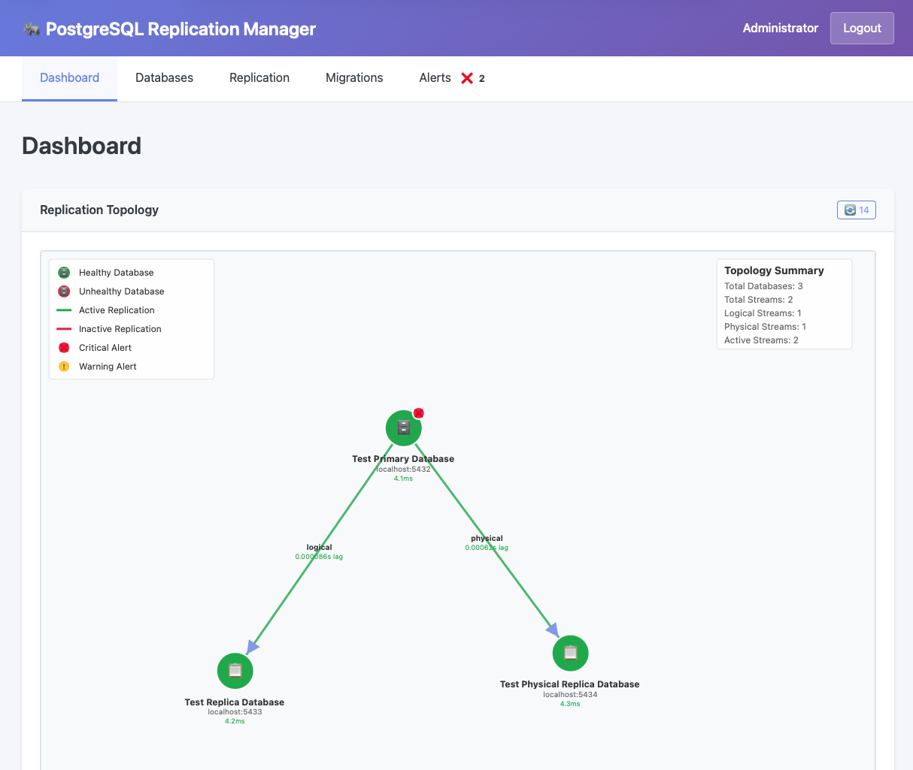

# PostgreSQL Replication Manager

[](https://github.com/ckdake/pgrepbot/actions/workflows/test.yml)
[](https://github.com/ckdake/pgrepbot/actions/workflows/build.yml)
[](https://github.com/ckdake/pgrepbot/actions/workflows/lint.yml)
[](https://github.com/ckdake/pgrepbot/actions/workflows/trivy.yml)
[](https://codecov.io/gh/ckdake/pgrepbot)
[](https://www.python.org/downloads/)
[](https://opensource.org/licenses/MIT)

A web-based tool for centralized management of PostgreSQL logical replication across multi-cloud environments (AWS, GCP) with support for monitoring physical replication streams.

## Features

- 🔄 **Logical Replication Management**: Create and manage PostgreSQL logical replication streams
- 👁️ **Physical Replication Monitoring**: Monitor existing RDS clusters, cross-region replicas, and read replicas
- 🌐 **Multi-Cloud Support**: Manage replication across AWS and GCP environments
- 🔐 **AWS Integration**: Seamless integration with Secrets Manager, ElastiCache, and RDS
- 🚀 **Schema Migrations**: Execute schema migrations across all replica endpoints
- 📊 **Visual Topology**: Interactive visualization of replication topology
- 🔔 **Alerting**: Configurable alerts for replication lag and failures

## Dashboard



The dashboard provides a comprehensive view of your PostgreSQL replication topology with:
- **Visual topology diagram** showing database connections and replication streams
- **Health status indicators** with response times for each database
- **Alert badges** on databases with active issues
- **Interactive layout** - drag nodes to arrange the topology as needed
- **Real-time monitoring** with automatic refresh and countdown timer

## Quick Start

### Local Development

For local development and testing:

#### Prerequisites

- Python 3.13+ installed
- Docker and Docker Compose installed
- Make (recommended for convenience commands)

#### Setup

```bash
# 1. Set up development environment (first time only)
make setup

# 2. Start all services (LocalStack, Redis, PostgreSQL with test replication)
make start

# 3. Run the application
make run

# 4. Visit the application
open http://localhost:8000
```

### AWS Deployment

For production deployment to AWS, this repository includes a complete Terraform module:

```bash
# Deploy to AWS using the Terraform module
# See terraform/modules/pgrepbot/README.md for complete documentation and examples

# Basic usage:
module "postgres_replication_manager" {
  source = "./terraform/modules/pgrepbot"
  
  application = "postgres-replication-manager"
  environment = "prod"
  vpc_id      = "vpc-12345678"
  
  domain_name                    = "pgrepbot.example.io"
  existing_alb_arn              = "arn:aws:elasticloadbalancing:..."
  existing_alb_listener_arn     = "arn:aws:elasticloadbalancing:..."
  existing_alb_security_group_id = "sg-alb123456"
  
  container_image        = "your-account.dkr.ecr.region.amazonaws.com/postgres-replication-manager:latest"
  container_registry_arn = "arn:aws:ecr:region:account:repository/postgres-replication-manager"
}
```

See [terraform/modules/pgrepbot/README.md](terraform/modules/pgrepbot/README.md) for complete documentation, examples, and deployment instructions.

### What You'll See

1. **Login Page**: Use auth key method with `dev-auth-key-12345`
2. **Interactive Dashboard**: Visual topology with test databases and replication streams
3. **Real-time Monitoring**: Live health status, response times, and alert indicators
4. **Alert Management**: Navigation bar shows active alerts with countdown timers
5. **Replication Management**: Create, monitor, and manage replication streams

### Stopping Services

```bash
# Stop everything (application + services)
make stop
```

This streamlined workflow:
1. Creates a Python virtual environment with all dependencies
2. Starts LocalStack for AWS service emulation
3. Starts Redis and PostgreSQL containers with pre-configured replication
4. Populates test data and replication streams automatically
5. Runs the FastAPI application with hot reload

## Access Points

- **Main Application**: http://localhost:8000 (Interactive dashboard with topology visualization)
- **API Documentation**: http://localhost:8000/docs (Comprehensive OpenAPI documentation)
- **Health Check**: http://localhost:8000/health (Application and service health status)
- **AWS Test Endpoints**: http://localhost:8000/api/aws/test (LocalStack integration testing)
- **LocalStack Dashboard**: http://localhost:4566 (AWS service emulation)

### Key API Endpoints

- `/api/databases/test` - Database connectivity testing
- `/api/replication/discover` - Replication topology discovery
- `/api/replication/create` - Create new replication streams
- `/api/auth/status` - Current authentication status
- `/api/alerts/` - Alert management and monitoring

## Development Commands

### 🚀 Simple Operations
```bash
make setup        # Set up development environment (first time only)
make start        # Start all services (LocalStack, Redis, PostgreSQL)
make stop         # Stop all services
make run          # Run application (services must be started first)
make clean        # Clean up everything and start fresh
```

### 🔧 Development Tools
```bash
make validate     # Validate all services and application are working
make lint         # Run code quality checks (ruff, shellcheck, hadolint)
make lint-fix     # Fix linting issues automatically
make status       # Show service status
```

### 🧪 Testing Suite
```bash
make test              # Run comprehensive test suite with coverage
make test-unit         # Run unit tests only (fast)
make test-integration  # Run integration tests
make test-e2e          # Run end-to-end workflow tests
make test-performance  # Run performance and load tests
make test-security     # Run security and validation tests
make test-data         # Generate comprehensive test data
```

### 📦 Production
```bash
make build        # Build production Docker image
```

**Note**: The virtual environment is automatically managed - no manual activation required!

## Architecture

### Local Development
- **FastAPI Backend**: Python web server with async PostgreSQL connectivity
- **LocalStack**: AWS service emulation for development (Secrets Manager, IAM)
- **Redis**: Direct Redis container for configuration and metrics caching
- **PostgreSQL**: Primary and replica containers for testing logical replication
- **Authentication**: IAM Identity Center, Secrets Manager, or auth key fallback

### AWS Production Deployment
- **ECS Fargate**: Containerized application with auto-scaling
- **Application Load Balancer**: HTTPS termination and load balancing
- **ElastiCache Redis**: Managed Redis for configuration and metrics caching
- **Secrets Manager**: Secure credential storage
- **CloudWatch**: Centralized logging and monitoring
- **Security Groups**: Network security with least privilege access

## Authentication Methods

The system supports three authentication methods with automatic fallback:

1. **Auth Key** (Development): Use `AUTH_KEY=dev-auth-key-12345` - perfect for testing and development
2. **AWS Secrets Manager**: Username/password stored in AWS Secrets Manager for production environments
3. **AWS IAM Identity Center**: SAML/OIDC integration for enterprise environments with SSO

The application automatically detects available authentication methods and provides appropriate login options.

## Development Status

### Production-Ready Features

🎉 **Fully Implemented:**
- **🔐 Multi-method Authentication**: IAM Identity Center, Secrets Manager, and Auth Key support with automatic fallback
- **🏗️ AWS Integration**: Complete LocalStack development environment with Secrets Manager, ElastiCache, RDS
- **🔌 Database Connection Management**: Async PostgreSQL connections with health monitoring, connection pooling, and credential resolution
- **🔍 Replication Discovery**: Automatic detection of logical and physical replication streams with real-time status monitoring
- **⚙️ Replication Stream Management**: Full lifecycle management - create, validate, monitor, and destroy replication streams
- **🔄 Schema Migration System**: Topology-aware migration execution with Redis tracking and PostgreSQL source of truth
- **🎨 Interactive Web Interface**: Modern FastAPI backend with responsive HTML/JavaScript frontend and D3.js topology visualization
- **📊 Visual Topology Dashboard**: Interactive drag-and-drop topology visualization with real-time health indicators
- **🚨 Advanced Alerting System**: Configurable thresholds, auto-resolution, Redis-backed alert management with detailed error reporting
- **⏱️ Real-time Monitoring**: Automated health checks with live status updates and background monitoring tasks
- **🏭 Production Deployment**: Complete Terraform module for AWS deployment with existing ALB integration
- **🔄 CI/CD Pipeline**: Automated testing, building, linting, and security scanning workflows
- **📱 Responsive Design**: Mobile-friendly interface with proper authentication flows and navigation

🔧 **Development & Production Ready:**
- **Local Development**: Complete Docker Compose setup with LocalStack AWS emulation
- **Test Environment**: Primary + Logical + Physical replica databases with automated test data
- **Production Deployment**: Terraform module for AWS ECS Fargate with existing ALB integration
- **Security by Default**: Always-encrypted Redis, 365-day log retention, comprehensive security scanning
- **CI/CD Pipeline**: Automated test, build, lint, and security workflows with multi-arch Docker builds
- **Migration Management**: Topology-aware schema migrations with retry and tracking capabilities
- **Real-time Monitoring**: Both replication types active with lag monitoring and alerting
- **Test Data Generation**: Automated setup of realistic replication scenarios

## CI/CD Pipeline

This project includes automated GitHub Actions workflows:

- **Lint**: Code quality checks with Ruff (formatting and linting)
- **Test**: Unit and integration tests with coverage reporting
- **Build**: Docker image build verification

All checks must pass before merging pull requests.

## Contributing

This project follows a spec-driven development approach. See the `.kiro/specs/postgres-replication-manager/` directory for detailed requirements, design, and implementation tasks.

### Development Workflow

1. Fork the repository
2. Create a feature branch
3. Make changes and ensure tests pass: `make test`
4. Run linting: `make lint`
5. Submit a pull request

## License

MIT License - see LICENSE file for details.